# AI Virtual Try-On – Architecture

## System Overview

```mermaid
flowchart TD
    USER["🧑 User Browser"] -->|"POST /api/tryon\n(person + clothing images)"| NGINX["Nginx\nReverse Proxy :80"]
    NGINX -->|"/api/*"| API["FastAPI Service :8000\n(preloaded models)"]
    NGINX -->|"/"| FE["Frontend Static\n(Nginx :80)"]
    API -->|"enqueue task"| REDIS["Redis :6379\n(broker + result backend)"]
    REDIS -->|"consume"| WORKER["Celery GPU Worker"]
    WORKER -->|"upload result"| S3["S3-Compatible\nObject Storage"]
    WORKER -->|"store job state"| REDIS
    USER -->|"GET /api/tryon/{id}\n(polling)"| API
    API -->|"read job state"| REDIS
    API -->|"presigned URL"| USER
    USER -->|"download result"| S3
```

## Pipeline Detail

## Technology Stack

| Layer | Technology |
|---|---|
| Base Model | Stable Diffusion XL (stabilityai/sdxl-base-1.0) |
| Pose Conditioning | ControlNet OpenPose SDXL |
| Human Parsing | Segformer B2 Clothes |
| Pose Detector | controlnet_aux OpenposeDetector |
| Blending | OpenCV (Poisson clone), MediaPipe (face) |
| API Framework | FastAPI + Uvicorn (uvloop) |
| Async Queue | Celery 5 + Redis 7 |
| Object Storage | S3-compatible (AWS / MinIO / Cloudflare R2) |
| Frontend | Vanilla HTML/CSS/JS (no framework) |
| Reverse Proxy | Nginx Alpine |
| Containerization | Docker + Docker Compose |
| GPU Target | NVIDIA A10G / A100 / RTX 3090+ |

## Deployment Targets

| Platform | Instance Type | Notes |
|---|---|---|
| AWS EC2 | g5.xlarge (A10G, 24GB) | Recommended for production |
| RunPod | RTX A4000 / A6000 | Cost-effective scaling |
| Lambda Labs | A100 80GB | High-throughput batch |
| Local Dev | RTX 3090 24GB | FP16 required |
